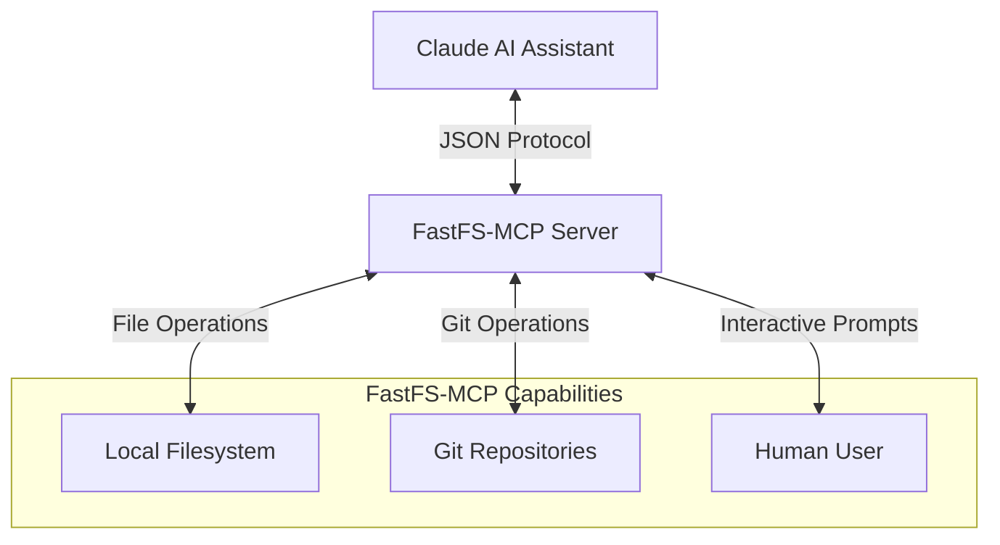
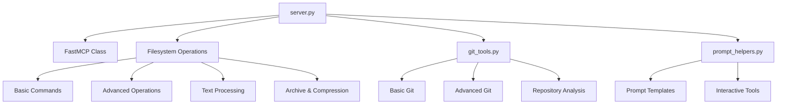
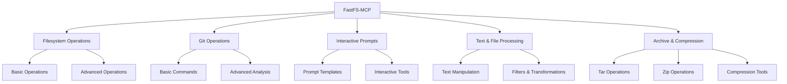
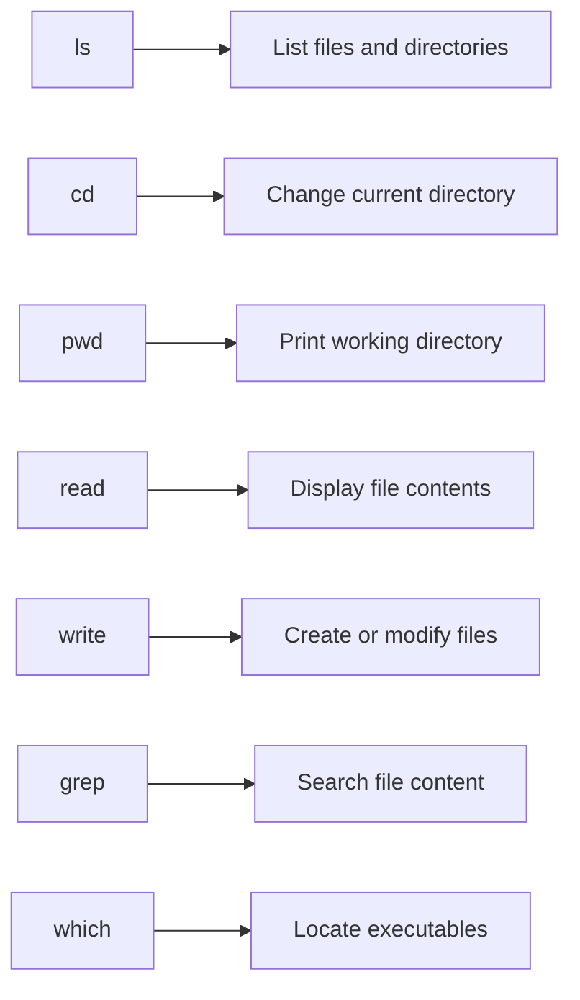
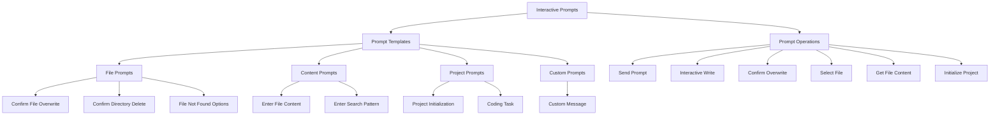
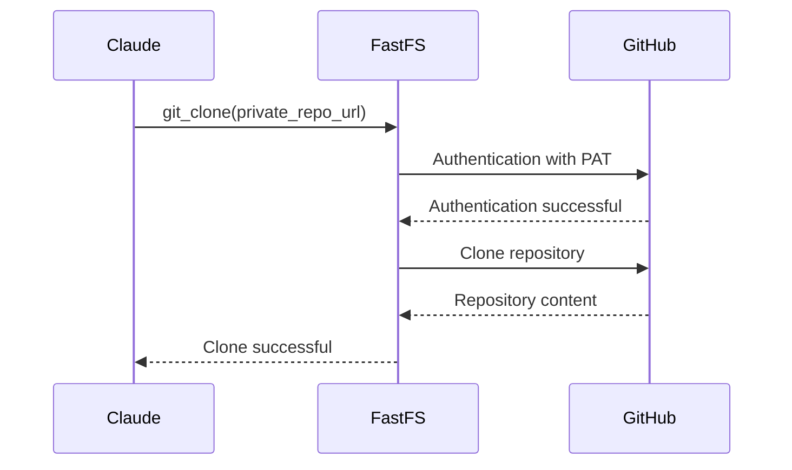

# FastFS-MCP

  

A high-speed MCP (Model Context Protocol) server for filesystem operations, Git integration, and interactive prompting capabilities, designed to work seamlessly with Claude and AI-native tooling.

## 🚀 Overview

FastFS-MCP enables AI assistants like Claude to interact with your local filesystem, manage Git repositories, and provide interactive experiences through a standardized JSON-based protocol. Whether you're building AI-assisted development workflows, creating content with Claude, or automating file management tasks, FastFS-MCP provides the bridge between your AI assistant and your local environment.



## ✨ Key Features

- **Ultra-fast filesystem operations**: Access, modify, and manage files with minimal latency
- **Complete Git integration**: Perform all standard Git operations and advanced repository analysis
- **Interactive prompting**: Enable Claude to engage users through structured prompts and forms
- **GitHub authentication**: Securely authenticate with GitHub using personal access tokens
- **JSON protocol**: Communicate with Claude Desktop, VSCode, and other AI-native tools using a standard interface

## 🛠️ Core Components Architecture



## 💻 Installation & Quick Start

### Docker Quick Start

```bash
# Build the Docker image
docker build -t fastfs-mcp .

# Run with your local filesystem mounted
docker run -i --rm \
  -v C:\\Users\\username:/mnt/workspace:rw \
  fastfs-mcp
```

> On Unix/macOS: replace with `-v $HOME:/mnt/workspace`

### With GitHub Authentication

```bash
docker run -i --rm \
  -v C:\\Users\\username:/mnt/workspace:rw \
  -e GITHUB_PERSONAL_ACCESS_TOKEN=ghp_your_token_here \
  fastfs-mcp
```

## 🤖 Claude Desktop Configuration

```json
{
  "mcpServers": {
    "filesystem": {
      "command": "docker",
      "args": [
        "run", "-i", "--rm",
        "-v", "C:\\Users\\username:/mnt/workspace:rw",
        "fastfs-mcp"
      ]
    }
  }
}
```

### With GitHub Authentication

```json
{
  "mcpServers": {
    "filesystem": {
      "command": "docker",
      "args": [
        "run", "-i", "--rm", 
        "-e", "GITHUB_PERSONAL_ACCESS_TOKEN",
        "-v", "C:\\Users\\username:/mnt/workspace:rw",
        "fastfs-mcp"
      ],
      "env": {
        "GITHUB_PERSONAL_ACCESS_TOKEN": "ghp_your_token_here"
      }
    }
  }
}
```

## 📋 Tool Categories

FastFS-MCP provides a comprehensive set of tools organized into logical categories:



## 🗂️ Filesystem Operations

### Basic Operations



| Method | Description |
|--------|-------------|
| `ls` | List files in a directory |
| `cd` | Change the current working directory |
| `pwd` | Print the current working directory |
| `read` | Read file contents |
| `write` | Create or overwrite file content |
| `grep` | Fast file searching via ripgrep |
| `which` | Locate executables in PATH |

### Advanced Operations

| Method | Description |
|--------|-------------|
| `tree` | Display directory structure |
| `find` | Find files by pattern |
| `cp` | Copy files or directories |
| `mv` | Move or rename files |
| `rm` | Remove files or directories |
| `mkdir` | Create directories |
| `stat` | Display file metadata |
| `chmod` | Change file permissions |
| `du` | Show disk usage |
| `df` | Show disk space |
| `touch` | Create a new empty file or update timestamp |

### Text & File Processing

| Method | Description |
|--------|-------------|
| `sed` | Stream editor for text transformation |
| `gawk` | Text processing with AWK |
| `head` | Show first lines of a file |
| `tail` | Show last lines of a file |
| `wc` | Count lines, words, and bytes |
| `cut` | Select columns from file |
| `sort` | Sort lines of text files |
| `uniq` | Report or filter repeated lines |
| `nl` | Number lines in a file |
| `split` | Split a file into smaller parts |
| `readlink` | Print the resolved path of a symbolic link |
| `realpath` | Print the resolved absolute path |

### Archive & Compression

| Method | Description |
|--------|-------------|
| `tar` | Create/extract tar archives |
| `gzip` | Compress/decompress files |
| `zip` | Create/extract zip archives |

## 🌿 Git Operations



```mermaid
graph TD
    Git[Git Operations] --> Repo[Repository Management]
    Git --> Changes[Change Management]
    Git --> Branch[Branch Operations]
    Git --> Remote[Remote Operations]
    Git --> Analysis[Repository Analysis]
    
    Repo --> init[Initialize Repository]
    Repo --> clone[Clone Repository]
    Repo --> status[Check Status]
    
    Changes --> add[Stage Changes]
    Changes --> commit[Commit Changes]
    Changes --> diff[View Differences]
    
    Branch --> checkout[Switch Branches]
    Branch --> branch[Manage Branches]
    Branch --> merge[Merge Branches]
    
    Remote --> push[Push Changes]
    Remote --> pull[Pull Changes]
    Remote --> fetch[Fetch Updates]
    
    Analysis --> context[Get Repository Context]
    Analysis --> validate[Validate Repository]
    Analysis --> suggest[Suggest Commit Messages]
    Analysis --> audit[Audit Repository History]
```

### Basic Git Operations

| Method | Description |
|--------|-------------|
| `clone` | Clone a Git repository |
| `init` | Initialize a new Git repository |
| `add` | Add file(s) to staging area |
| `commit` | Commit changes to repository |
| `status` | Show working tree status |
| `push` | Push changes to remote repository |
| `pull` | Pull changes from remote repository |
| `log` | Show commit logs |
| `checkout` | Switch branches or restore files |
| `branch` | List, create, or delete branches |
| `merge` | Join development histories together |
| `show` | Show Git objects |
| `diff` | Show changes between commits/working tree |
| `remote` | Manage remote repositories |
| `stash` | Stash changes in working directory |
| `tag` | Manage Git tags |
| `config` | Get or set repository or global options |
| `fetch` | Download objects and refs from another repository |
| `blame` | Show what revision and author last modified each line of a file |
| `git_grep` | Print lines matching a pattern in tracked files |
| `head` | Show the current HEAD commit information |

### Advanced Git Analysis

| Method | Description |
|--------|-------------|
| `context` | Get comprehensive repo context |
| `repo_info` | Get detailed repository information |
| `validate` | Check repository for common issues |
| `summarize_log` | Generate commit log statistics |
| `suggest_commit` | Auto-suggest commit messages |
| `audit_history` | Audit repository for security issues |

## 🤝 Interactive Prompts



### Prompt Templates

| Template | Description |
|----------|-------------|
| `confirm_file_overwrite` | Ask user to confirm before overwriting an existing file |
| `confirm_directory_delete` | Warn user before deleting a directory |
| `file_not_found_options` | Provide options when a file is not found |
| `enter_file_content` | Get content for a file from the user |
| `enter_search_pattern` | Ask user for a search pattern |
| `project_initialization` | Collect information to initialize a new project |
| `coding_task` | Define parameters of a coding task |
| `select_file_from_list` | Let user select a file from a list |
| `custom` | Create a completely custom prompt message |

### Interactive Functions

| Function | Description |
|----------|-------------|
| `prompt` | Send an interactive prompt to the user |
| `get_prompt_types` | List available prompt templates |
| `interactive_write` | Write file with user-provided content |
| `confirm_overwrite` | Ask before overwriting files |
| `select_file` | Let user choose from file list |
| `get_file_content` | Get content for file from user |
| `init_project` | Initialize project with guided setup |

## 📝 Protocol Usage

FastFS-MCP uses a simple JSON-based protocol to communicate with Claude and other AI tools.

### Request Format

```json
{
  "method": "METHOD_NAME",
  "params": {
    "param1": "value1",
    "param2": "value2"
  }
}
```

### Response Format

```json
{
  "result": RESPONSE_DATA
}
```

### Examples

#### Basic File Operation

```json
// Request
{
  "method": "ls",
  "params": { "path": "." }
}

// Response
{
  "result": ["main.tf", "README.md"]
}
```

#### Git Repository Context

```json
// Request
{
  "method": "context",
  "params": {}
}

// Response
{
  "result": {
    "current_branch": "main",
    "repository_root": "/mnt/workspace/my-project",
    "is_clean": false,
    "head_commit": "a1b2c3d4e5f6...",
    "remotes": {
      "origin": "https://github.com/user/repo.git"
    },
    "recent_commits": [
      "a1b2c3d4 Update README.md",
      "b2c3d4e5 Fix bug in main function",
      "c3d4e5f6 Add new feature"
    ]
  }
}
```

#### Interactive Prompt Flow

```
// Request
{
  "method": "prompt",
  "params": { 
    "prompt_type": "custom", 
    "message": "What would you like to name your file?" 
  }
}

// Response to stdout (visible to user)
{
  "type": "user_prompt",
  "prompt": "What would you like to name your file?"
}

// User response (from stdin)
{
  "type": "user_response",
  "response": "myfile.txt"
}

// Final result to Claude
{
  "result": {
    "response": "myfile.txt",
    "timestamp": 1622548123.45
  }
}
```

## 🔧 GitHub Authentication

FastFS-MCP supports GitHub authentication using a Personal Access Token (PAT) to enable secure Git operations with GitHub repositories.



When a GitHub PAT is provided via the `GITHUB_PERSONAL_ACCESS_TOKEN` environment variable, Git operations that interact with GitHub (clone, push, pull, fetch) will automatically use the token for authentication, enabling:

- Access to private repositories
- Operations that require authentication (push, create repo, etc.)
- Avoiding rate limits on API calls

## 🐳 Docker Environment

FastFS-MCP runs in a Docker container for portability and isolation, with the following tools installed:

- `ripgrep` for high-performance file searching
- `jq` for JSON parsing and manipulation
- `sed` and `gawk` for text processing
- `tree` for directory visualization
- `fd-find` for alternative file finding
- `coreutils` for standard Unix tools
- `zip/unzip`, `gzip`, and `xz-utils` for compression
- `git` for repository operations

## 🚀 Use Cases

- **AI-assisted development**: Let Claude help you code, manage files, and use Git all within the same conversation
- **Content creation workflows**: Enable Claude to read, write, and organize files for writing projects
- **Repository management**: Get insights into Git repositories and automate common Git operations
- **Interactive project setup**: Guide users through structured project initialization with interactive prompts
- **System administration**: Perform file system operations and maintenance tasks with AI assistance

## 🔒 Security Considerations

FastFS-MCP provides direct access to your filesystem and Git repositories. Consider the following security practices:

1. Only run FastFS-MCP with appropriate file system permissions
2. Mount only the directories you need to expose to Claude
3. Use separate GitHub PATs with limited scope for authentication
4. Regularly review the logs and commands executed by the server

## 📄 License

FastFS-MCP is released under the MIT License. See the LICENSE file for details.

## 🤝 Contributing

Contributions are welcome! Please feel free to submit a Pull Request.

1. Fork the repository
2. Create your feature branch (`git checkout -b feature/amazing-feature`)
3. Commit your changes (`git commit -m 'Add some amazing feature'`)
4. Push to the branch (`git push origin feature/amazing-feature`)
5. Open a Pull Request

## 📚 Further Documentation

- [Prompt Guide](prompt_guide.md) - Detailed documentation on interactive prompts
- [Claude Prompt Examples](claude_prompt_examples.md) - Examples of how Claude can use FastFS-MCP
- [Claude Prompt Guide](claude_prompt_guide.md) - Guide for Claude on working with FastFS-MCP

---

Built for AI-enhanced CLI and developer workflows with speed, structure, and simplicity.
