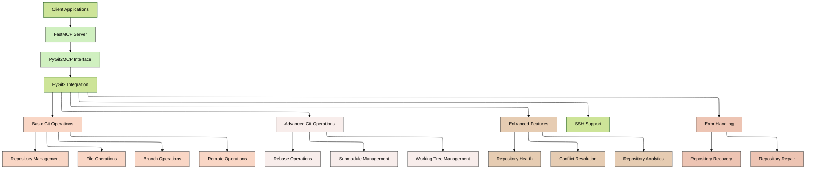
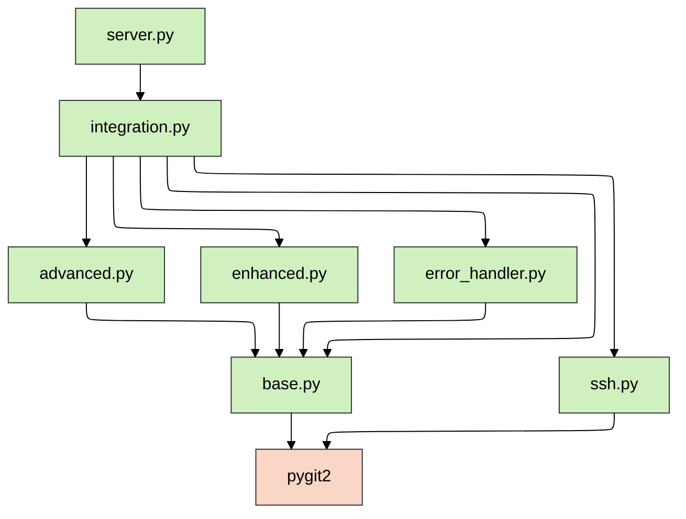
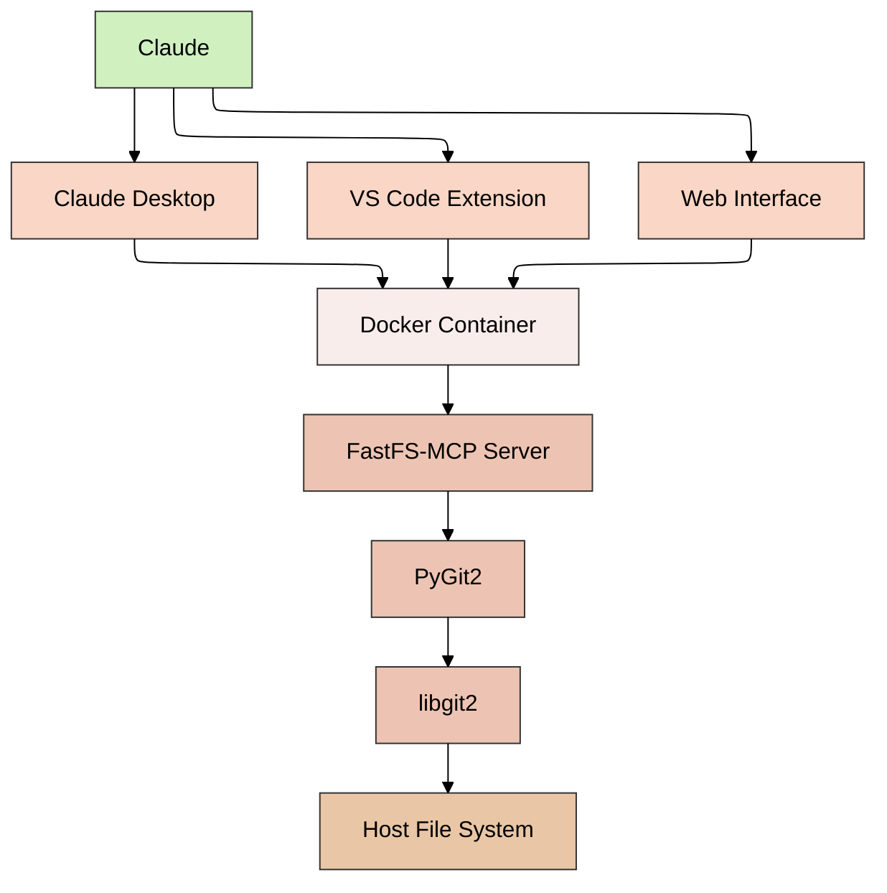

# FastFS-MCP Architecture

This document outlines the architecture and design of FastFS-MCP with PyGit2 integration.

## Architecture Overview

FastFS-MCP is built on a modular architecture with layered components:



## Component Descriptions

### Server Layer

- **FastMCP Server**: Main MCP server component that handles incoming JSON-RPC requests
- **PyGit2MCP Interface**: Interface layer that translates between FastMCP and PyGit2 Integration

### Integration Layer

- **PyGit2 Integration**: Core integration component that provides a unified interface to all PyGit2 features

### Core Git Operations

- **Repository Management**: Basic repository operations like init, clone, fetch
- **File Operations**: File-level Git operations like add, commit, reset
- **Branch Operations**: Branch management operations like branch, checkout, merge
- **Remote Operations**: Remote repository operations like remote, push, pull

### Advanced Git Operations

- **Rebase Operations**: Advanced rebase functionality with conflict handling
- **Submodule Management**: Submodule operations like add, update, list
- **Working Tree Management**: Working tree operations like add, list, remove

### Enhanced Features

- **Repository Health**: Repository health checks and optimization suggestions
- **Conflict Resolution**: Tools for resolving merge conflicts
- **Repository Analytics**: Repository analysis and insights

### Error Handling

- **Repository Recovery**: Tools for recovering from errors
- **Repository Repair**: Tools for repairing corrupted repositories

## Data Flow

1. Client sends a JSON-RPC request to the FastMCP server
2. FastMCP server processes the request and forwards it to PyGit2MCP
3. PyGit2MCP translates the request to a PyGit2 Integration call
4. PyGit2 Integration executes the operation using the appropriate Git module
5. Result flows back through the layers to the client

## Authentication Flow

```mermaid
flowchart TD
    %% Configuration
    %%{init: { 'theme': 'forest', 'handDrawn': true, 'layout': 'elk' } }%%
    
    Start[Client Request] --> Auth{Authentication<br/>Required?}
    Auth -->|Yes| Method{Auth Method}
    Auth -->|No| Exec[Execute Git Command]
    
    Method -->|Token| Token[GitHub Token Auth]
    Method -->|SSH| SSH[SSH Key Auth]
    Method -->|Username/Password| Basic[Basic Auth]
    
    Token --> ConfigCB[Configure Callbacks]
    SSH --> ConfigCB
    Basic --> ConfigCB
    
    ConfigCB --> Exec
    Exec --> Result[Return Result]
    
    %% Styling
    classDef start fill:#d0f0c0,stroke:#333,stroke-width:1px
    classDef decision fill:#f9d6c5,stroke:#333,stroke-width:1px
    classDef action fill:#f8edeb,stroke:#333,stroke-width:1px
    classDef end fill:#edc4b3,stroke:#333,stroke-width:1px
    
    class Start start
    class Auth,Method decision
    class Token,SSH,Basic,ConfigCB,Exec action
    class Result end
```

## Error Handling Flow

```mermaid
flowchart TD
    %% Configuration
    %%{init: { 'theme': 'forest', 'handDrawn': true, 'layout': 'elk' } }%%
    
    Start[Git Operation] --> Try{Try Operation}
    Try -->|Success| Result[Return Result]
    Try -->|Error| Handle[Error Handler]
    
    Handle --> Type{Error Type}
    Type -->|Repository| Repo[Repository Error]
    Type -->|Authentication| Auth[Authentication Error]
    Type -->|Network| Net[Network Error]
    Type -->|Other| Other[Other Error]
    
    Repo --> RepairCheck{Can Repair?}
    RepairCheck -->|Yes| Repair[Repair Repository]
    RepairCheck -->|No| Error[Return Error]
    
    Auth --> Retry{Retry?}
    Retry -->|Yes| RetryAuth[Retry with New Auth]
    Retry -->|No| Error
    
    Net --> NetRetry{Retry?}
    NetRetry -->|Yes| RetryNet[Retry Operation]
    NetRetry -->|No| Error
    
    Other --> Error
    
    Repair --> RetryOp[Retry Operation]
    RetryOp --> Result
    RetryAuth --> Try
    RetryNet --> Try
    
    %% Styling
    classDef start fill:#d0f0c0,stroke:#333,stroke-width:1px
    classDef decision fill:#f9d6c5,stroke:#333,stroke-width:1px
    classDef action fill:#f8edeb,stroke:#333,stroke-width:1px
    classDef end fill:#edc4b3,stroke:#333,stroke-width:1px
    
    class Start start
    class Try,Type,RepairCheck,Retry,NetRetry decision
    class Handle,Repo,Auth,Net,Other,Repair,RetryOp,RetryAuth,RetryNet action
    class Result,Error end
```

## Module Dependencies



## Deployment Architecture


